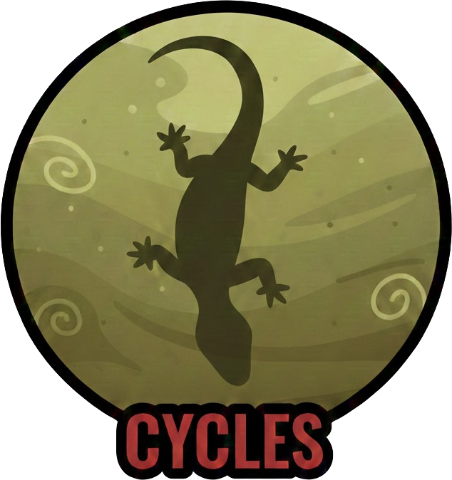

# 🦎 Cycles

Un gioco survival ciclico dove vivi la vita di una salamandra, generazione dopo generazione.



## 📚 Documentazione

- **[Game Design Document](docs/GAME_DESIGN_DOCUMENT.md)** - Tutte le meccaniche e scelte di design
- **[Architettura Tecnica](docs/ARCHITECTURE.md)** - Struttura codice e pattern
- **[Changelog](docs/CHANGELOG.md)** - Storia dello sviluppo e decisioni

## 🎮 Concept

Parti come un piccolo uovo di salamandra in uno stagno. Cresci, sopravvivi ai predatori, mangia, fai amicizia con altre salamandre, trova un partner, deponi le uova... e il ciclo ricomincia. Ogni generazione eredita tratti dalla precedente.

### Fasi di Vita

1. **🥚 Uovo** - Sei vulnerabile, puoi solo scuoterti per respingere i predatori
2. **🐛 Larva** - Impara a muoverti, mangia microorganismi, nasconditi tra le piante
3. **🦎 Giovane** - Sei più veloce, esplora, fai amicizia con altre salamandre
4. **🦎 Adulto** - Trova un partner, deponi le uova, passa i tuoi tratti alla prossima generazione

### Meccaniche Chiave

- **Movimento Point-and-Click** - Funziona sia su desktop che mobile
- **Sistema Genetico** - I tratti si ereditano con genetica mendeliana reale
- **Albinismo** - Tratto recessivo raro, come nella realtà (25% se entrambi i genitori sono portatori)
- **Mondo che Invecchia** - Lo stagno si riduce ogni 5 cicli, gli uccelli diventano più comuni
- **Amicizie** - Le salamandre che incontri spesso possono diventare partner
- **Nessuna UI invadente** - Feedback visivo sul personaggio, niente barre vita

## 🚀 Setup

```bash
# Clona il progetto
git clone <repo>
cd salamandra-cycles

# Installa dipendenze
pnpm install

# Avvia in modalità sviluppo
pnpm dev

# Avvia in modalità trial (cicli più veloci per testing)
pnpm dev:trial

# Build per produzione
pnpm build
```

## 🛠 Stack Tecnologico

- **Phaser 3** - Game engine 2D con supporto pixel art
- **TypeScript** - Type safety
- **Vite** - Build tool veloce
- **pnpm** - Package manager

## 📁 Struttura Progetto

```
salamandra-cycles/
├── src/
│   ├── main.ts              # Entry point
│   ├── config/
│   │   └── gameConfig.ts    # Tutte le costanti di gioco
│   ├── scenes/
│   │   ├── BootScene.ts     # Caricamento e menu
│   │   ├── EggScene.ts      # Fase uovo
│   │   ├── LarvaScene.ts    # Fase larva
│   │   ├── JuvenileScene.ts # Fase giovane (TODO)
│   │   └── AdultScene.ts    # Fase adulta (TODO)
│   ├── systems/
│   │   └── GameState.ts     # Stato globale e salvataggio
│   ├── data/
│   │   └── traits.ts        # Sistema genetico
│   └── entities/            # (TODO) Classi entità
├── public/
│   └── assets/              # Sprite e asset
├── package.json
├── tsconfig.json
├── vite.config.ts
└── index.html
```

## 🎨 Palette Colori

Ispirata all'immagine di riferimento - acqua torbida, verdi e marroni naturali:

| Elemento | Colore |
|----------|--------|
| Acqua superficie | `#8fa67a` |
| Acqua media | `#6b8c5a` |
| Acqua profonda | `#4a6b3a` |
| Salamandra corpo | `#4a5c3a` |
| Salamandra ventre | `#8fa67a` |
| Uovo guscio | `#c9d4b8` |

## 🧬 Sistema Genetico

### Tratti Ereditari

- **Speed** (1-10) - Velocità di movimento
- **Size** (1-10) - Dimensione (influenza cosa puoi mangiare)
- **Stamina** (1-10) - Resistenza al movimento
- **Perception** (1-10) - Raggio visivo
- **Colori** - Si mescolano tra i genitori
- **Pattern** - spots, stripes, plain, mottled

### Mutazioni Speciali

- **Albinismo** - Autosomica recessiva (come nella realtà)
- **Gigantismo** - +3 size, -2 speed
- **Iridescenza** - Colori cangianti
- **Neotenia** - Mantiene branchie da adulto
- **Uova Dormienti** - MOLTO RARO - le uova sopravvivono alla siccità

## 📅 Roadmap

### Fase 1 (Corrente)
- [x] Setup progetto
- [x] Configurazione di gioco
- [x] Sistema genetico
- [x] Scena uovo
- [x] Scena larva (base)
- [ ] Sprite pixel art

### Fase 2
- [ ] Scena giovane
- [ ] Sistema amicizia
- [ ] Predatori più intelligenti

### Fase 3
- [ ] Scena adulta
- [ ] Corteggiamento
- [ ] Schermata eredità fine ciclo

### Fase 4
- [ ] Stagno che si riduce
- [ ] Uova dormienti (meccanica rinascita)
- [ ] Polish e bilanciamento

## 🐛 Variabili d'Ambiente

```bash
# .env
VITE_GAME_MODE=normal  # 'normal' o 'trial'
```

**Trial mode**: Cicli più veloci (~10 min invece di ~25 min), debug overlay abilitato.

## 📝 Note di Design

- **Niente musica per ora** - Focus sul gameplay
- **Single player** - Nessun multiplayer
- **UI minimale** - Il feedback è sul personaggio, non su barre e numeri
- **Morte = apprendimento** - Puoi rispawnare come fratello (30% chance)
- **Il gioco non ti dice tutto** - Scopri le meccaniche giocando

## 📜 Licenza

MIT

---

*Ispirato da una foto di una salamandra che nuota in acque torbide, sospesa, vulnerabile, bellissima.*
